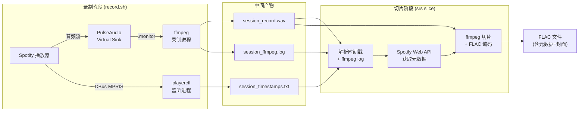
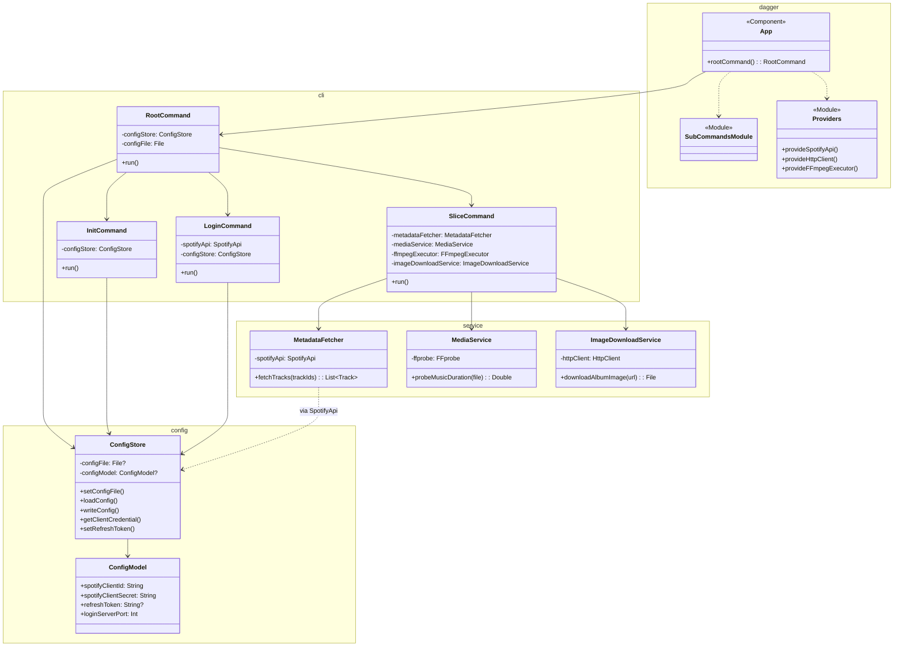
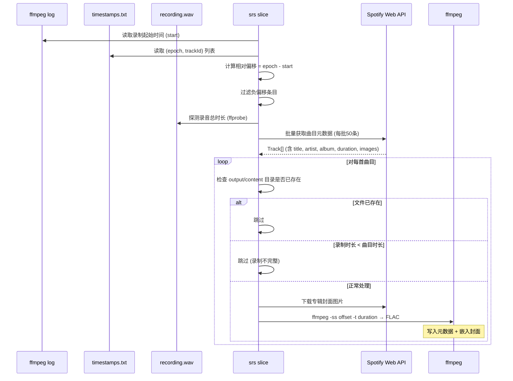

# SRS 初版设计方案

> 日期：2025-12-20（初版大致完成时间）
>
> 项目：SRS (Spotify Recording Slicer)
>
> 许可证：AGPL-3.0

## 1. 项目概述

SRS 是一个 Linux 平台上的 Spotify 音乐录制与切片工具。其核心目标是：将 Spotify 播放的音乐以无损方式录制下来，再按曲目自动切分为独立的 FLAC 文件，并从 Spotify Web API 获取完整的元数据（标题、艺术家、专辑、封面等）写入文件。

### 1.1 使用场景

作者在 Linux 上使用 Spotify，希望在本地维护一份自己喜爱音乐的镜像。典型的使用方式是在睡觉时通过 `timeout 6h ./record.sh` 让 Spotify 自动播放并录制一整夜，次日再运行切片工具离线处理。

### 1.2 系统约束

- **仅 Linux**：依赖 PulseAudio/PipeWire 的虚拟 sink 和 DBus MPRIS 协议
- **外部依赖**：`ffmpeg`、`ffprobe`、`playerctl`、`pactl`
- **Spotify 账号**：需要 Spotify Developer Dashboard 上创建的应用（获取 Client ID/Secret）以及用户授权

### 1.3 技术栈

| 层面 | 技术选型 |
|------|---------|
| 录制脚本 | Bash, ffmpeg, playerctl |
| 切片程序 | Kotlin (JVM 21) |
| 构建系统 | Gradle (Kotlin DSL) |
| CLI 框架 | Clikt 5.0 |
| 依赖注入 | Dagger 2 (KSP) |
| Spotify API | spotify-web-api-java 9.4.0 |
| FFmpeg 封装 | net.bramp.ffmpeg 0.8.0 |
| 本地 HTTP 服务器 | Javalin 6.7.0 |
| 序列化 | kotlinx-serialization-json |
| 日志 | Logback |

## 2. 整体架构

### 2.1 两阶段工作流

系统分为**录制**和**切片**两个完全独立的阶段。录制阶段由 Bash 脚本完成，产生中间文件；切片阶段由 Kotlin CLI 程序消费这些中间文件并产出最终的 FLAC 文件。



### 2.2 Kotlin 程序模块结构



### 2.3 数据流



## 3. 录制阶段设计

### 3.1 音频捕获方案

使用 PulseAudio 的 `module-null-sink` 创建虚拟音频设备，将 Spotify 的输出重定向到此设备，然后用 ffmpeg 从该设备的 `.monitor` 源录制。

**创建虚拟 sink：**

```bash
pactl load-module module-null-sink \
    sink_name=SpotifySink \
    sink_properties=device.description="Spotify_Virtual_Cable" \
    format=float32le rate=44100 channels=2
```

**ffmpeg 录制参数：**

```bash
ffmpeg -y \
    -f pulse -ch_layout stereo -ac 2 -ar 44100 \
    -i SpotifySink.monitor \
    -c:a pcm_f32le -sample_fmt flt -rf64 auto \
    session_record.wav
```

| 参数 | 值 | 说明 |
|------|----|------|
| 输入格式 | pulse | PulseAudio 音频源 |
| 声道 | stereo (2ch) | 与 Spotify 输出一致 |
| 采样率 | 44100 Hz | CD 品质，与 Spotify 输出一致 |
| 编码 | pcm_f32le | 32位浮点 PCM，无损 |
| 容器 | WAV (rf64 auto) | 超过 4GB 自动切换为 RF64 格式 |

选择 `rf64 auto` 是因为长时间录制（如 6 小时）产生的文件极易超过标准 WAV 的 4GB 限制。

**录制前准备要求：**

- 关闭 Spotify 的"标准化音量"（Normalize volume）选项
- 使用最高音质设置
- 将音量调至最大
- 预先下载要录制的音乐（提高录制质量和稳定性）

这些准备是为了确保录制到的音频尽量接近 Spotify 传输的原始数据，避免客户端的动态音量调整和网络波动影响音质。

### 3.2 曲目时间戳采集

使用 `playerctl` 的 follow 模式 (`-F`) 持续监听 Spotify 通过 DBus MPRIS 广播的媒体信息变化。

```bash
playerctl -p spotify metadata -F --format '{{ mpris:trackid }}|{{ status }}'
```

**设计决策：为何使用 playerctl 而非 Java 直接接入 DBus**

此前尝试过在 Java/Kotlin 中直接使用 DBus 库监听 MPRIS 信号，但发现延迟过高，无法及时捕获曲目切换事件。`playerctl` 作为成熟的 MPRIS 客户端，响应速度足够，且通过管道输出便于脚本处理。

**Track ID 清洗逻辑：**

Spotify 返回的 track ID 可能有两种格式：
- `spotify:track:0cMCCfgXNvzpn9AgFJib76`
- `/com/spotify/track/0cMCCfgXNvzpn9AgFJib76`

脚本通过 `sed` 统一提取纯 ID（如 `0cMCCfgXNvzpn9AgFJib76`）。

**去重逻辑：**

仅当 track ID 变化**且**播放状态为 `Playing` 时，才记录一条时间戳。这避免了暂停/恢复、重复事件等情况产生冗余记录。

**输出格式（`session_timestamps.txt`）：**

```
1734567890.123,0cMCCfgXNvzpn9AgFJib76
1734567920.456,7xGfFoTpQ2E7fRF5lN10tr
```

每行格式为 `<unix_epoch_ms精度>,<spotify_track_id>`。

### 3.3 时间同步机制

录制阶段的核心挑战是将音频流中的位置与曲目信息对齐。方案依赖两个独立时间源的共同参考系——系统时钟（Unix epoch）：

1. **ffmpeg log** 中的 `start:` 字段提供了录制开始时的绝对时间（Unix epoch 秒）
2. **playerctl** 输出的每条记录携带 `date +%s.%3N` 产生的绝对时间戳

两者的差值即为曲目在录音文件中的相对偏移量。这个计算在切片阶段执行。

## 4. 切片阶段设计

### 4.1 CLI 架构

程序入口通过 Dagger 创建依赖图，获取 `RootCommand` 实例并执行：

```kotlin
DaggerApp.create().rootCommand().main(args)
```

**命令树结构：**

```
srs [-c/--config <path>]     # RootCommand: 设置配置文件路径
  ├── init -i <id> -s <secret> [-f]   # InitCommand: 初始化配置
  ├── login                            # LoginCommand: OAuth2 授权
  └── slice -o <dir> -c <dir> [-a <sec>] [-t <file>] [-r <file>] [-l <file>]
                                       # SliceCommand: 执行切片
```

**Dagger 依赖注入结构：**

子命令通过 `@Binds @IntoSet` 多绑定注入 `RootCommand`。`RootCommand` 接收 `Set<CliktCommand>` 并通过 `subcommands()` 注册。这使得添加新子命令只需：
1. 创建新的 `CliktCommand` 实现类
2. 在 `SubCommandsModule` 中添加一个 `@Binds @IntoSet` 方法

**SpotifyApi 的懒加载：**

`LoginCommand` 和 `SliceCommand` 中的 `SpotifyApi` 及 `MetadataFetcher` 通过 `Provider<T>` 注入并使用 `by lazy` 延迟初始化。这是因为 `SpotifyApi` 的构造需要读取配置文件中的 credential，而配置文件路径在 `RootCommand.run()` 中才设定。如果不做懒加载，Dagger 在创建对象图时就会尝试访问尚未初始化的配置。

### 4.2 配置管理

**配置文件格式（JSON）：**

```json
{
    "spotifyClientId": "...",
    "spotifyClientSecret": "...",
    "refreshToken": "...",
    "loginServerPort": 3000
}
```

默认路径：`~/.srs/config.json`，可通过 `srs -c <path>` 覆盖。

**ConfigStore 线程安全设计：**

使用 `ReentrantReadWriteLock` 保护 `configModel` 的读写。`configFile` 字段使用 `@Volatile` 标记，设计上应在启动时设置一次后不再变更。

### 4.3 Spotify OAuth2 授权

采用 Authorization Code Flow：

1. 生成随机 `state` 参数用于 CSRF 防护
2. 构建授权 URL，申请 scope：`playlist-read-private`, `user-read-playback-state`, `user-read-currently-playing`
3. 启动 Javalin 本地 HTTP 服务器监听 `localhost:3000`（端口可通过配置文件的 `loginServerPort` 字段更改）
4. 用户在浏览器中完成授权后，Spotify 重定向到本地服务器
5. 服务器验证 `state` 参数，提取 authorization code
6. 用 authorization code 换取 access token 和 refresh token
7. 将 refresh token 持久化到配置文件

**Token 自动刷新（`Providers.provideSpotifyApi`）：**

每次需要 `SpotifyApi` 实例时，Provider 从配置中读取 refresh token，调用 `authorizationCodeRefresh()` 获取新的 access token。如果返回了新的 refresh token，立即更新配置文件。

### 4.4 时间对齐算法

这是切片流程的核心算法，负责将 timestamps 文件中的绝对时间戳映射为录音文件中的精确位置。

**步骤：**

1. **提取录制起始时间**：从 ffmpeg log 中找到包含 `Duration: N/A, start:` 的行，解析出 `start` 值（Unix epoch 秒，浮点数）

2. **计算相对偏移**：对 timestamps 文件中的每条记录 `(epoch, trackId)`，计算：
   ```
   offset = epoch - startRecordingTime
   ```

3. **过滤无效条目**：丢弃 `offset <= 0` 的条目（录制开始之前的事件）

4. **按偏移排序**：确保处理顺序与录音中的实际顺序一致

5. **确定每首曲目的可用录制时长**：
   ```
   recordingTime = nextTrackStart - currentTrackStart
   ```
   最后一首曲目使用 `recordingDuration - currentTrackStart`

6. **完整性检查**：若 `recordingTime < track.durationMs / 1000.0`，说明该曲目录制不完整（可能被中断），跳过不处理

**timingCorrection 参数：**

由于 DBus 事件和实际音频播放之间存在不确定的延迟，提供 `-a/--adjustment` 参数（单位：秒）进行手动微调：

```
actualStart = offset + timingCorrection
```

- 若切出的音频包含下一首歌的开头 → 减小此值（如 `-0.1`）
- 若切出的音频末尾不完整 → 增大此值

此参数需要用户根据实际切片结果手动调试确定。

### 4.5 音频切片与编码

**设计决策：为何选择整段录制 + 离线切片**

选择"先完整录制再离线切片"而非"实时按曲目录制"，原因是：

- **实时切分对时间精度要求极高**：需要在 DBus 事件到达的瞬间立即切断/启动录制，现有工具链难以满足这种实时性
- **离线处理的容错性好**：可以多次尝试不同的 `timingCorrection` 参数；对处理性能没有实时性约束
- **使用场景适配**：作者在睡觉时通过 virtual sink 录制，不需要实时产出结果

**ffmpeg 切片调用：**

对每首曲目，使用 `-ss`（起始偏移）和 `-t`（持续时长）进行精确切割：

```
ffmpeg -ss <offset> -t <duration> -i recording.wav -i album_cover.jpg \
    -c:a flac -sample_fmt s32 -compression_level 8 \
    -map 0:a -map 1:0 -c:v copy -disposition:v attached_pic \
    -metadata title=... -metadata artist=... -metadata album=... \
    -metadata track=... -metadata disc=... -metadata spotifyTrackId=... \
    output.flac
```

其中 `duration` 取自 Spotify API 返回的 `track.durationMs`（毫秒转秒），而非根据下一首歌的偏移计算。这确保每首歌的长度精确匹配其元数据中声明的时长。

### 4.6 输出格式与元数据

**设计决策：为何选择 FLAC 而非 WAV**

WAV 格式不支持嵌入元数据（标题、艺术家、专辑封面等），而 FLAC 作为无损压缩格式，原生支持丰富的 metadata tag 和嵌入式图片。从 Spotify API 获取的元数据可以完整写入 FLAC 文件，使最终产出成为自描述的音乐文件。

**FLAC 编码参数：**

| 参数 | 值 | 说明 |
|------|----|------|
| 采样格式 | s32 (有符号32位整数) | 保留录制精度 |
| 压缩级别 | 8 | 最高压缩率（解码速度影响可忽略） |

**写入的元数据字段：**

| 字段 | 来源 | 说明 |
|------|------|------|
| `title` | `track.name` | 曲目标题 |
| `artist` | `track.artists[*].name` | 多艺术家以 `, ` 连接 |
| `album` | `track.album.name` | 专辑名称 |
| `track` | `track.trackNumber` | 曲目序号（从1开始） |
| `disc` | `track.discNumber` | 碟片序号（从1开始） |
| `spotifyTrackId` | `track.id` | 自定义字段，记录 Spotify ID |

**专辑封面嵌入：**

通过 `ImageDownloadService` 从 Spotify API 返回的专辑图片 URL 下载最高分辨率的封面，作为 ffmpeg 的第二个输入（`input 1`）。使用 `-map 1:0 -c:v copy -disposition:v attached_pic` 将其作为附加图片嵌入 FLAC 文件。封面图片为临时文件，处理完成后立即删除。

### 4.7 文件组织与去重

**输出目录结构：**

```
<output_folder>/
└── <AlbumName> (<AlbumArtist>)/
    └── Disk <N>/
        └── <TrackNumber>. <TrackName>.flac
```

文件名中的 `/` 字符被替换为 `-`，防止创建非预期的子目录。专辑名使用 `album.artists.first().name` 作为补充标识（区分同名专辑）。

**双目录去重机制：**

切片时检查两个目录：

- **output 目录**：切片产出的目标目录
- **content 目录**：已经人工审核确认无误的内容库

若任一目录中已存在同名文件，则跳过该曲目。推荐工作流程：

1. 切片产出到 output 目录
2. 人工逐首检查切片质量（尤其是曲目结尾是否完整）
3. 检查通过的文件移入 content 目录
4. 下次切片时自动跳过 content 中已有的曲目

### 4.8 元数据获取

**批量查询策略：**

Spotify Web API 的 `Get Several Tracks` 接口单次最多查询 50 首。`MetadataFetcher.fetchTracks` 将 track ID 列表按 50 个一组分批请求，然后合并结果。

**accept-language header：**

通过 Dagger 注入的 `@Named("spotifyApiHeader")` 提供了 `accept-language: zh-CN,zh;q=0.9,zh-Hans;q=0.8,en;q=0.7`。这控制 Spotify API 返回的元数据语言，使中文歌曲能返回中文名称。

## 5. 关键设计决策汇总

| 决策点 | 选定方案 | 考虑过的替代方案 | 选择理由 |
|--------|---------|----------------|---------|
| 录制策略 | 整段录制 + 离线切片 | 实时按曲目切分录制 | 实时切分对时间精度要求过高，现有工具链无法满足；离线处理容错性好，可多次尝试 |
| 曲目信息采集 | playerctl (Bash) | Java/Kotlin 直接接入 DBus | Java DBus 库延迟过高，无法及时捕获曲目切换事件 |
| 输出格式 | FLAC | WAV, OPUS 等 | FLAC 无损且支持嵌入元数据和封面，WAV 不支持嵌入元数据 |
| 时间对齐 | 手动 timingCorrection 参数 | - | DBus 事件与音频播放间存在不确定延迟，目前无自动化方案，需用户手动调试 |
| 曲目切片时长 | 使用 Spotify API 返回的 durationMs | 使用相邻曲目偏移差 | API 时长更精确，避免将曲间静音或下一首开头包含进来 |
| 去重策略 | output + content 双目录检查 | 数据库记录 | 简单直接，基于文件系统，无需额外依赖 |
| 依赖注入 | Dagger 2 (编译时) | Koin, 手动注入等 | 编译时生成代码，无运行时反射开销 |
| CLI 框架 | Clikt | picocli 等 | Kotlin-first 设计，API 简洁 |
